# 03 · 思维导图与关键图集

> 本文是 Mermaid 源文件。浏览器可视化版本：打开 [mindmap.html](mindmap.html)（由 `build-mindmap.mjs` 从本文件生成）。
> 若使用支持 Mermaid 的 Markdown 工具（Typora、VS Code、GitLab、语雀等），可直接预览。

---

## 1. 平台总览

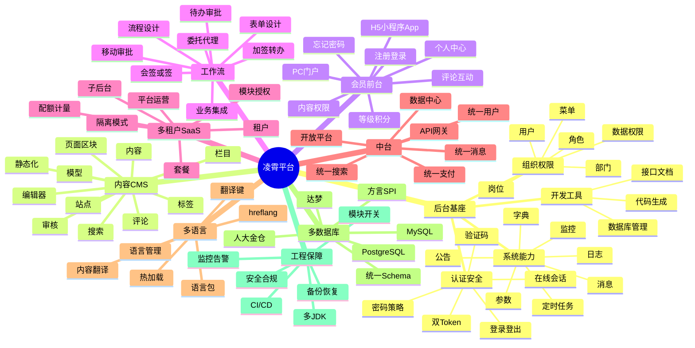
```mermaid
mindmap
  root((凌霄平台))
    后台基座
      认证安全
        登录登出
        验证码
        双Token
        密码策略
        在线会话
      组织权限
        用户
        角色
        菜单
        部门
        岗位
        数据权限
      系统能力
        字典
        参数
        公告
        日志
        定时任务
        消息
        监控
      开发工具
        代码生成
        接口文档
        数据库管理
    内容CMS
      站点
      栏目
      模型
      内容
      标签
      页面区块
      评论
      编辑器
      审核
      静态化
      搜索
    会员前台
      注册登录
      忘记密码
      个人中心
      等级积分
      内容权限
      评论互动
      PC门户
      H5小程序App
    工作流
      流程设计
      表单设计
      待办审批
      会签或签
      加签转办
      委托代理
      业务集成
      移动审批
    多租户SaaS
      租户
      套餐
      模块授权
      子后台
      隔离模式
      配额计量
      平台运营
    中台
      统一用户
      统一消息
      统一搜索
      统一支付
      开放平台
      API网关
      数据中心
    多语言
      语言管理
      翻译键
      语言包
      热加载
      内容翻译
      hreflang
    多数据库
      MySQL
      PostgreSQL
      达梦
      人大金仓
      方言SPI
      统一Schema
    工程保障
      多JDK
      模块开关
      CI/CD
      监控告警
      备份恢复
      安全合规
```

---

## 2. 后台基座

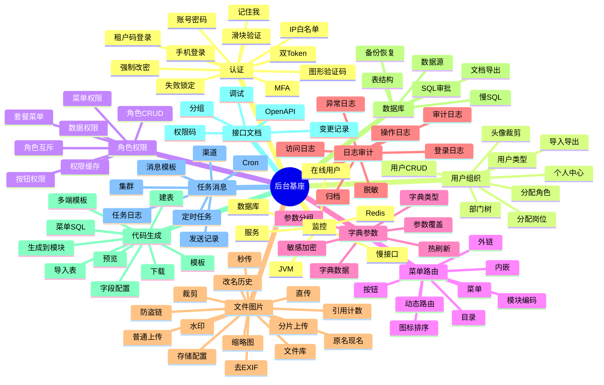
```mermaid
mindmap
  root((后台基座))
    认证
      账号密码
      手机登录
      图形验证码
      滑块验证
      MFA
      双Token
      记住我
      强制改密
      失败锁定
      IP白名单
      租户码登录
    用户组织
      用户CRUD
      导入导出
      分配角色
      分配岗位
      部门树
      用户类型
      个人中心
      头像裁剪
    角色权限
      角色CRUD
      菜单权限
      按钮权限
      数据权限
      角色互斥
      权限缓存
      套餐菜单
    菜单路由
      目录
      菜单
      按钮
      外链
      内嵌
      动态路由
      图标排序
      模块编码
    字典参数
      字典类型
      字典数据
      参数分组
      参数覆盖
      敏感加密
      热刷新
    日志审计
      操作日志
      登录日志
      异常日志
      访问日志
      审计日志
      脱敏
      归档
    文件图片
      存储配置
      普通上传
      分片上传
      秒传
      直传
      文件库
      缩略图
      去EXIF
      原名现名
      改名历史
      裁剪
      水印
      引用计数
      防盗链
    数据库
      数据源
      表结构
      备份恢复
      慢SQL
      SQL审批
      文档导出
    代码生成
      导入表
      建表
      字段配置
      模板
      预览
      下载
      生成到模块
      菜单SQL
      多端模板
    接口文档
      分组
      调试
      权限码
      OpenAPI
      变更记录
    任务消息
      定时任务
      Cron
      集群
      任务日志
      消息模板
      渠道
      发送记录
    监控
      服务
      JVM
      Redis
      数据库
      慢接口
      在线用户
```

---

## 3. CMS

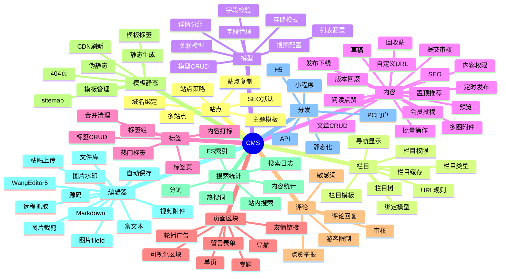
```mermaid
mindmap
  root((CMS))
    站点
      多站点
      域名绑定
      主题模板
      SEO默认
      站点策略
      站点复制
    栏目
      栏目树
      栏目类型
      绑定模型
      栏目模板
      栏目权限
      导航显示
      URL规则
      栏目缓存
    模型
      模型CRUD
      字段管理
      字段校验
      列表配置
      搜索配置
      详情分组
      存储模式
      关联模型
    内容
      文章CRUD
      草稿
      提交审核
      发布下线
      定时发布
      置顶推荐
      批量操作
      版本回滚
      预览
      回收站
      多图附件
      内容权限
      阅读点赞
      SEO
      自定义URL
      会员投稿
    标签
      标签组
      标签CRUD
      合并清理
      内容打标
      标签页
      热门标签
    页面区块
      单页
      可视化区块
      导航
      轮播广告
      友情链接
      专题
      留言表单
    评论
      评论回复
      审核
      敏感词
      点赞举报
      游客限制
    模板静态
      模板管理
      模板标签
      静态生成
      伪静态
      sitemap
      404页
      CDN刷新
    搜索统计
      站内搜索
      分词
      热搜词
      搜索日志
      ES索引
      内容统计
    编辑器
      WangEditor5
      富文本
      Markdown
      源码
      粘贴上传
      远程抓取
      视频附件
      图片fileId
      图片裁剪
      图片水印
      文件库
      自动保存
    分发
      PC门户
      H5
      小程序
      API
      静态化
```

---

## 4. 会员与前台

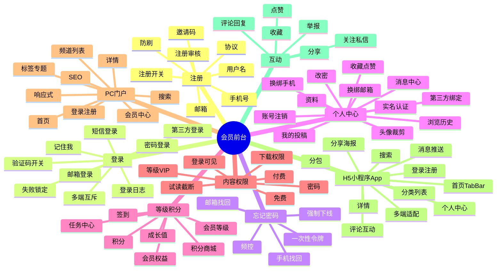
```mermaid
mindmap
  root((会员前台))
    注册
      用户名
      手机号
      邮箱
      注册开关
      注册审核
      邀请码
      防刷
      协议
    登录
      密码登录
      短信登录
      邮箱登录
      第三方登录
      记住我
      验证码开关
      失败锁定
      多端互斥
      登录日志
    忘记密码
      手机找回
      邮箱找回
      一次性令牌
      强制下线
      频控
    个人中心
      资料
      头像裁剪
      改密
      换绑手机
      换绑邮箱
      第三方绑定
      实名认证
      账号注销
      消息中心
      收藏点赞
      浏览历史
      我的投稿
    等级积分
      会员等级
      成长值
      积分
      签到
      任务中心
      会员权益
      积分商城
    内容权限
      免费
      登录可见
      等级VIP
      付费
      密码
      试读截断
      下载权限
    PC门户
      首页
      频道列表
      详情
      标签专题
      搜索
      登录注册
      会员中心
      SEO
      响应式
    H5小程序App
      首页TabBar
      分类列表
      详情
      搜索
      登录注册
      个人中心
      评论互动
      分享海报
      分包
      多端适配
      消息推送
    互动
      评论回复
      点赞
      收藏
      分享
      举报
      关注私信
```

---

## 5. 工作流

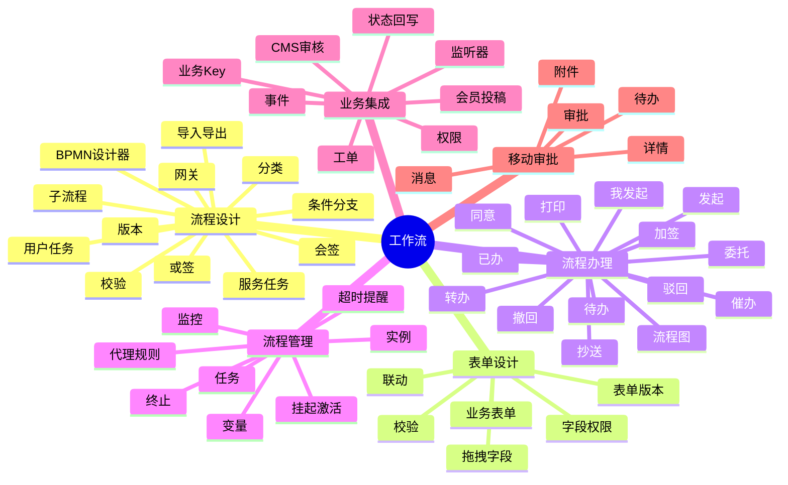
```mermaid
mindmap
  root((工作流))
    流程设计
      分类
      BPMN设计器
      用户任务
      服务任务
      网关
      子流程
      会签
      或签
      条件分支
      版本
      校验
      导入导出
    表单设计
      拖拽字段
      校验
      联动
      字段权限
      业务表单
      表单版本
    流程办理
      发起
      待办
      已办
      我发起
      抄送
      同意
      驳回
      撤回
      加签
      转办
      委托
      催办
      流程图
      打印
    流程管理
      实例
      任务
      变量
      挂起激活
      终止
      代理规则
      超时提醒
      监控
    业务集成
      业务Key
      状态回写
      事件
      监听器
      权限
      CMS审核
      会员投稿
      工单
    移动审批
      待办
      详情
      审批
      附件
      消息
```

---

## 6. SaaS 与中台

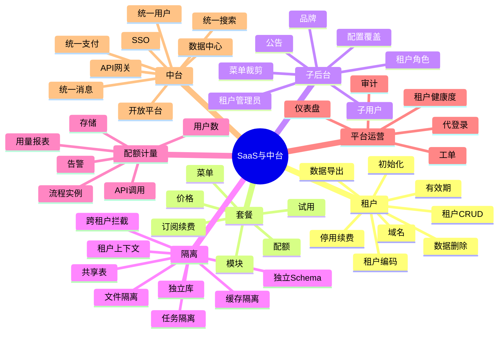
```mermaid
mindmap
  root((SaaS与中台))
    租户
      租户CRUD
      租户编码
      域名
      有效期
      初始化
      停用续费
      数据导出
      数据删除
    套餐
      模块
      菜单
      配额
      价格
      试用
      订阅续费
    子后台
      租户管理员
      子用户
      租户角色
      菜单裁剪
      配置覆盖
      品牌
      公告
    隔离
      共享表
      独立Schema
      独立库
      租户上下文
      缓存隔离
      文件隔离
      任务隔离
      跨租户拦截
    配额计量
      用户数
      存储
      API调用
      流程实例
      用量报表
      告警
    平台运营
      仪表盘
      租户健康度
      代登录
      工单
      审计
    中台
      统一用户
      SSO
      统一消息
      统一搜索
      统一支付
      开放平台
      API网关
      数据中心
```

---

## 7. 权限体系

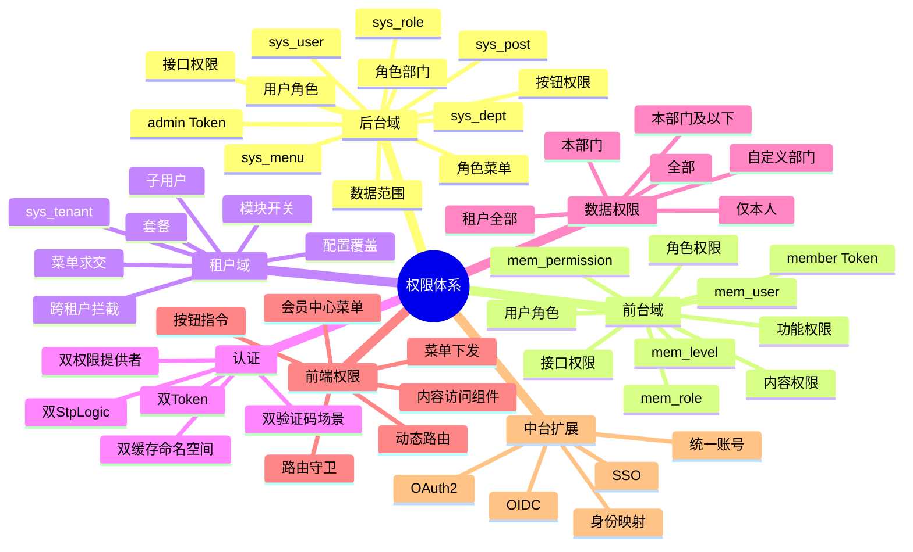
```mermaid
mindmap
  root((权限体系))
    后台域
      sys_user
      sys_role
      sys_menu
      sys_dept
      sys_post
      用户角色
      角色菜单
      角色部门
      数据范围
      按钮权限
      接口权限
      admin Token
    前台域
      mem_user
      mem_role
      mem_permission
      mem_level
      用户角色
      角色权限
      内容权限
      功能权限
      接口权限
      member Token
    租户域
      sys_tenant
      套餐
      模块开关
      子用户
      菜单求交
      配置覆盖
      跨租户拦截
    认证
      双StpLogic
      双Token
      双验证码场景
      双缓存命名空间
      双权限提供者
    数据权限
      全部
      自定义部门
      本部门
      本部门及以下
      仅本人
      租户全部
    前端权限
      动态路由
      菜单下发
      按钮指令
      路由守卫
      会员中心菜单
      内容访问组件
    中台扩展
      统一账号
      身份映射
      SSO
      OAuth2
      OIDC
```

---

## 8. 技术工程

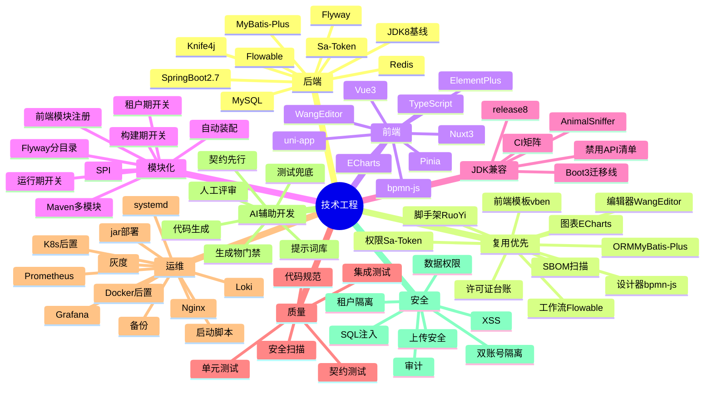
```mermaid
mindmap
  root((技术工程))
    后端
      JDK8基线
      SpringBoot2.7
      Sa-Token
      MyBatis-Plus
      MySQL
      Redis
      Flyway
      Flowable
      Knife4j
    复用优先
      脚手架RuoYi
      前端模板vben
      权限Sa-Token
      ORMMyBatis-Plus
      工作流Flowable
      编辑器WangEditor
      设计器bpmn-js
      图表ECharts
      许可证台账
      SBOM扫描
    前端
      Vue3
      TypeScript
      ElementPlus
      Nuxt3
      uni-app
      Pinia
      WangEditor
      bpmn-js
      ECharts
    模块化
      Maven多模块
      自动装配
      构建期开关
      运行期开关
      租户期开关
      SPI
      Flyway分目录
      前端模块注册
    JDK兼容
      release8
      CI矩阵
      AnimalSniffer
      禁用API清单
      Boot3迁移线
    质量
      单元测试
      集成测试
      契约测试
      安全扫描
      代码规范
    运维
      jar部署
      Nginx
      启动脚本
      systemd
      Docker后置
      K8s后置
      Prometheus
      Grafana
      Loki
      备份
      灰度
    AI辅助开发
      契约先行
      代码生成
      提示词库
      生成物门禁
      人工评审
      测试兜底
    安全
      双账号隔离
      租户隔离
      数据权限
      XSS
      SQL注入
      上传安全
      审计
```

---

## 9. 模块依赖图

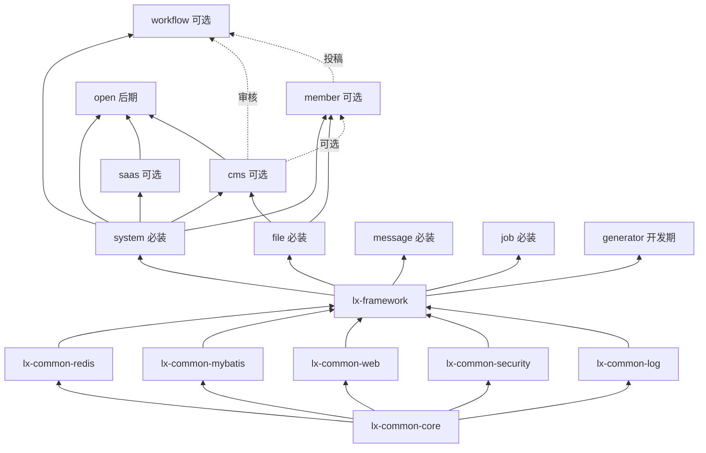
```mermaid
flowchart BT
  CORE["lx-common-core"]
  REDIS["lx-common-redis"]
  MP["lx-common-mybatis"]
  WEB["lx-common-web"]
  SEC["lx-common-security"]
  LOG["lx-common-log"]
  FW["lx-framework"]

  SYS["system 必装"]
  FILE["file 必装"]
  MSG["message 必装"]
  JOB["job 必装"]
  GEN["generator 开发期"]
  CMS["cms 可选"]
  MEM["member 可选"]
  WF["workflow 可选"]
  SAAS["saas 可选"]
  OPEN["open 后期"]

  CORE --> REDIS
  CORE --> MP
  CORE --> WEB
  CORE --> SEC
  CORE --> LOG
  REDIS --> FW
  MP --> FW
  WEB --> FW
  SEC --> FW
  LOG --> FW

  FW --> SYS
  FW --> FILE
  FW --> MSG
  FW --> JOB
  FW --> GEN
  SYS --> CMS
  FILE --> CMS
  SYS --> MEM
  FILE --> MEM
  SYS --> WF
  SYS --> SAAS
  SYS --> OPEN
  SAAS --> OPEN
  CMS --> OPEN

  CMS -.可选.-> MEM
  CMS -.审核.-> WF
  MEM -.投稿.-> WF
```

---

## 10. 用户角色地图

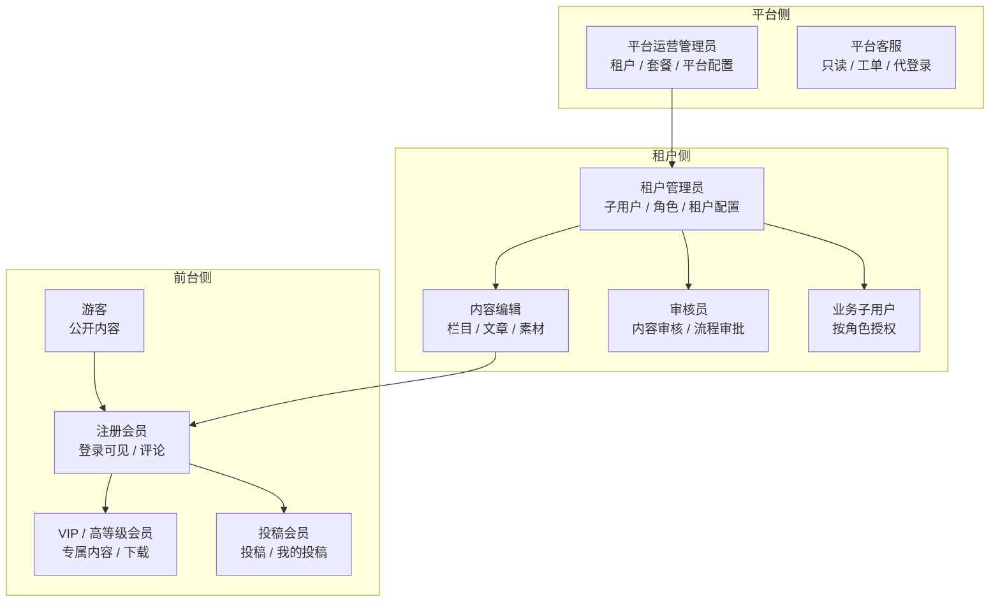
```mermaid
flowchart TB
  subgraph 平台侧
    P1["平台运营管理员<br/>租户 / 套餐 / 平台配置"]
    P2["平台客服<br/>只读 / 工单 / 代登录"]
  end

  subgraph 租户侧
    T1["租户管理员<br/>子用户 / 角色 / 租户配置"]
    T2["内容编辑<br/>栏目 / 文章 / 素材"]
    T3["审核员<br/>内容审核 / 流程审批"]
    T4["业务子用户<br/>按角色授权"]
  end

  subgraph 前台侧
    M1["游客<br/>公开内容"]
    M2["注册会员<br/>登录可见 / 评论"]
    M3["VIP / 高等级会员<br/>专属内容 / 下载"]
    M4["投稿会员<br/>投稿 / 我的投稿"]
  end

  P1 --> T1
  T1 --> T2
  T1 --> T3
  T1 --> T4
  M1 --> M2 --> M3
  M2 --> M4
  T2 --> M2
```

---

## 11. 内容状态机

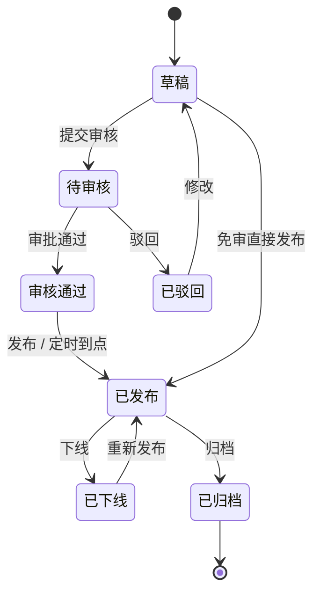
```mermaid
stateDiagram-v2
  state "草稿" as Draft
  state "待审核" as Pending
  state "审核通过" as Approved
  state "已发布" as Published
  state "已驳回" as Rejected
  state "已下线" as Offline
  state "已归档" as Archived

  [*] --> Draft
  Draft --> Pending: 提交审核
  Pending --> Approved: 审批通过
  Pending --> Rejected: 驳回
  Rejected --> Draft: 修改
  Approved --> Published: 发布 / 定时到点
  Published --> Offline: 下线
  Offline --> Published: 重新发布
  Published --> Archived: 归档
  Draft --> Published: 免审直接发布
  Archived --> [*]
```

---

## 12. 图片处理链路

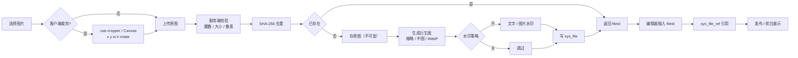
```mermaid
flowchart LR
  U["选择图片"] --> C{"客户端裁剪?"}
  C -- 是 --> CROP["vue-cropper / Canvas<br/>x y w h rotate"]
  C -- 否 --> UP["上传原图"]
  CROP --> UP
  UP --> V["服务端校验<br/>魔数 / 大小 / 像素"]
  V --> H["SHA-256 去重"]
  H --> Q{"已存在"}
  Q -- 是 --> R["返回 fileId"]
  Q -- 否 --> O["存原图（不可变）"]
  O --> P["生成衍生图<br/>缩略 / 中图 / WebP"]
  P --> W{"水印策略"}
  W -- 开 --> WM["文字 / 图片水印"]
  W -- 关 --> SKIP["跳过"]
  WM --> DB["写 sys_file"]
  SKIP --> DB
  DB --> R
  R --> ED["编辑器插入 fileId"]
  ED --> REF["sys_file_ref 引用"]
  REF --> PUB["发布 / 前台展示"]
```

---

## 13. SaaS 隔离与上下文

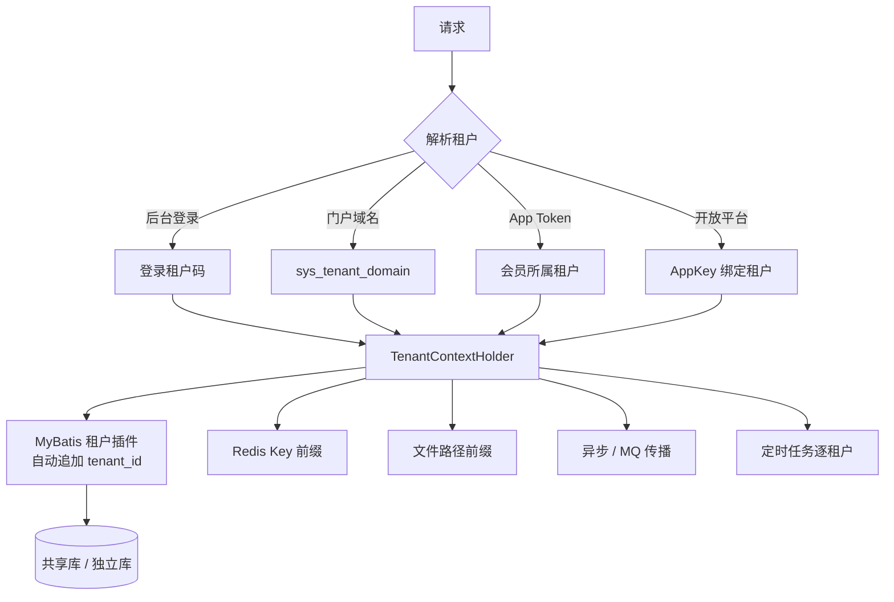
```mermaid
flowchart TB
  REQ["请求"] --> RES{"解析租户"}
  RES -- 后台登录 --> T1["登录租户码"]
  RES -- 门户域名 --> T2["sys_tenant_domain"]
  RES -- App Token --> T3["会员所属租户"]
  RES -- 开放平台 --> T4["AppKey 绑定租户"]
  T1 --> CTX["TenantContextHolder"]
  T2 --> CTX
  T3 --> CTX
  T4 --> CTX
  CTX --> MP["MyBatis 租户插件<br/>自动追加 tenant_id"]
  CTX --> RD["Redis Key 前缀"]
  CTX --> FS["文件路径前缀"]
  CTX --> AS["异步 / MQ 传播"]
  CTX --> JOB["定时任务逐租户"]
  MP --> DB[("共享库 / 独立库")]
```

---

## 14. 工作流审批时序

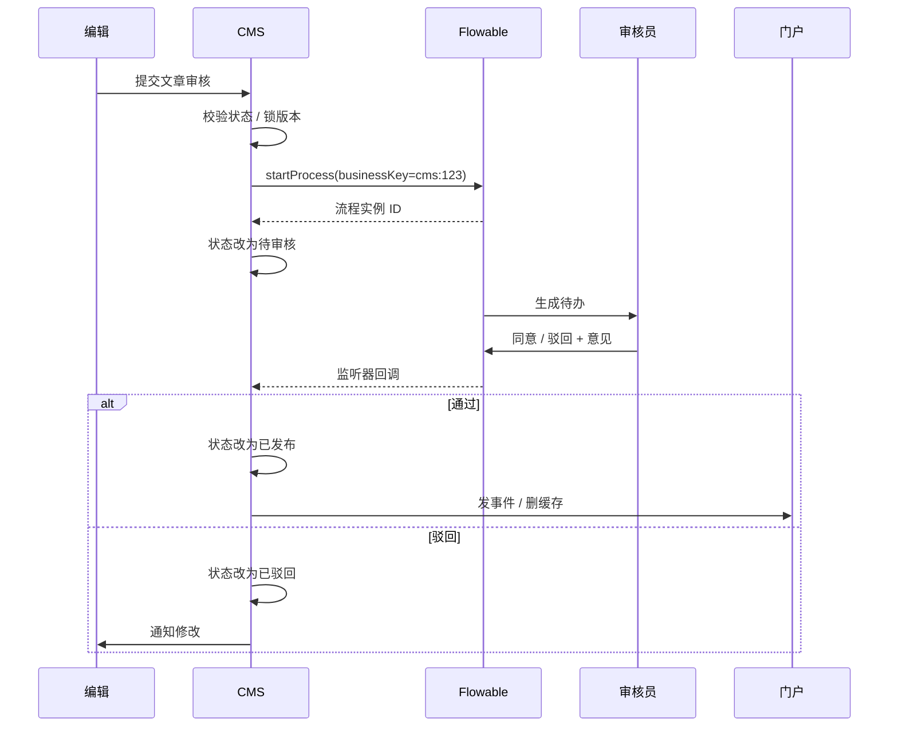
```mermaid
sequenceDiagram
  participant E as 编辑
  participant C as CMS
  participant W as Flowable
  participant A as 审核员
  participant P as 门户

  E->>C: 提交文章审核
  C->>C: 校验状态 / 锁版本
  C->>W: startProcess(businessKey=cms:123)
  W-->>C: 流程实例 ID
  C->>C: 状态改为待审核
  W->>A: 生成待办
  A->>W: 同意 / 驳回 + 意见
  W-->>C: 监听器回调
  alt 通过
    C->>C: 状态改为已发布
    C->>P: 发事件 / 删缓存
  else 驳回
    C->>C: 状态改为已驳回
    C->>E: 通知修改
  end
```

---

## 15. 双账号登录时序

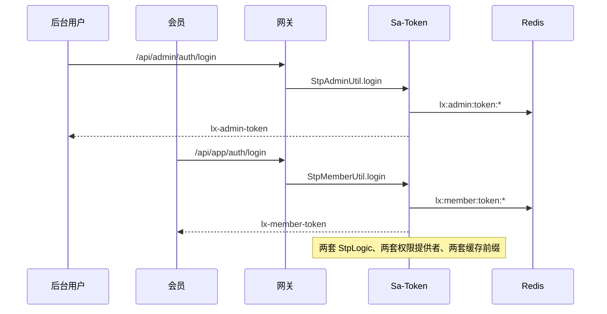
```mermaid
sequenceDiagram
  participant A as 后台用户
  participant M as 会员
  participant G as 网关
  participant S as Sa-Token
  participant R as Redis

  A->>G: /api/admin/auth/login
  G->>S: StpAdminUtil.login
  S->>R: lx:admin:token:*
  S-->>A: lx-admin-token

  M->>G: /api/app/auth/login
  G->>S: StpMemberUtil.login
  S->>R: lx:member:token:*
  S-->>M: lx-member-token

  Note over S: 两套 StpLogic、两套权限提供者、两套缓存前缀
```

---

## 16. 版本演进

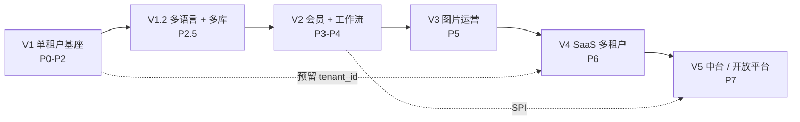
```mermaid
flowchart LR
  V1["V1 单租户基座<br/>P0-P2"] --> V1D["V1.2 多语言 + 多库<br/>P2.5"]
  V1D --> V2["V2 会员 + 工作流<br/>P3-P4"]
  V2 --> V3["V3 图片运营<br/>P5"]
  V3 --> V4["V4 SaaS 多租户<br/>P6"]
  V4 --> V5["V5 中台 / 开放平台<br/>P7"]
  V1 -.预留 tenant_id.-> V4
  V2 -.SPI.-> V5
```

---

## 17. 一张图看懂“开关关闭后不加载”

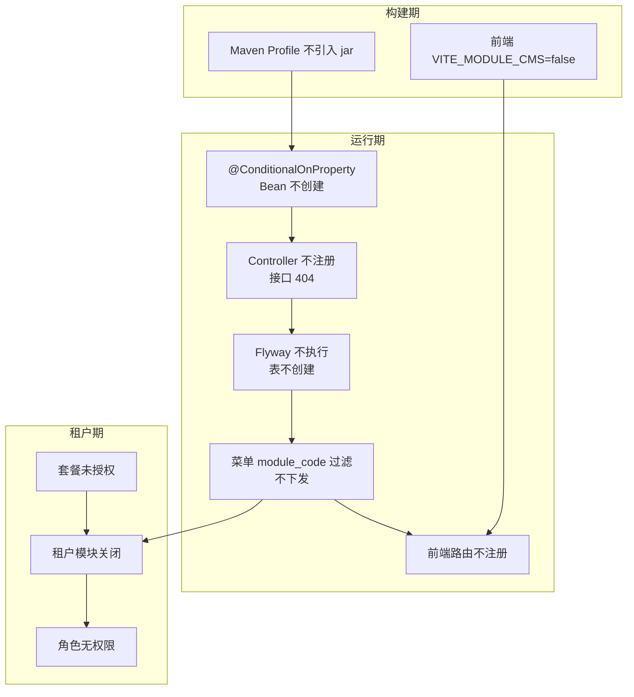
```mermaid
flowchart TB
  subgraph 构建期
    B1["Maven Profile 不引入 jar"]
    B2["前端 VITE_MODULE_CMS=false"]
  end
  subgraph 运行期
    R1["@ConditionalOnProperty<br/>Bean 不创建"]
    R2["Controller 不注册<br/>接口 404"]
    R3["Flyway 不执行<br/>表不创建"]
    R4["菜单 module_code 过滤<br/>不下发"]
    R5["前端路由不注册"]
  end
  subgraph 租户期
    T1["套餐未授权"]
    T2["租户模块关闭"]
    T3["角色无权限"]
  end
  B1 --> R1
  B2 --> R5
  R1 --> R2 --> R3 --> R4 --> R5
  T1 --> T2 --> T3
  R4 --> T2
```

---

## 18. 多数据库兼容

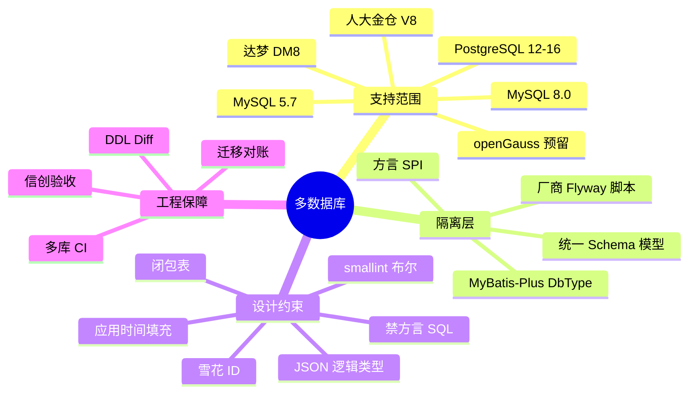
```mermaid
mindmap
  root((多数据库))
    支持范围
      MySQL 5.7
      MySQL 8.0
      PostgreSQL 12-16
      达梦 DM8
      人大金仓 V8
      openGauss 预留
    隔离层
      方言 SPI
      MyBatis-Plus DbType
      统一 Schema 模型
      厂商 Flyway 脚本
    设计约束
      雪花 ID
      应用时间填充
      smallint 布尔
      JSON 逻辑类型
      闭包表
      禁方言 SQL
    工程保障
      多库 CI
      DDL Diff
      迁移对账
      信创验收
```

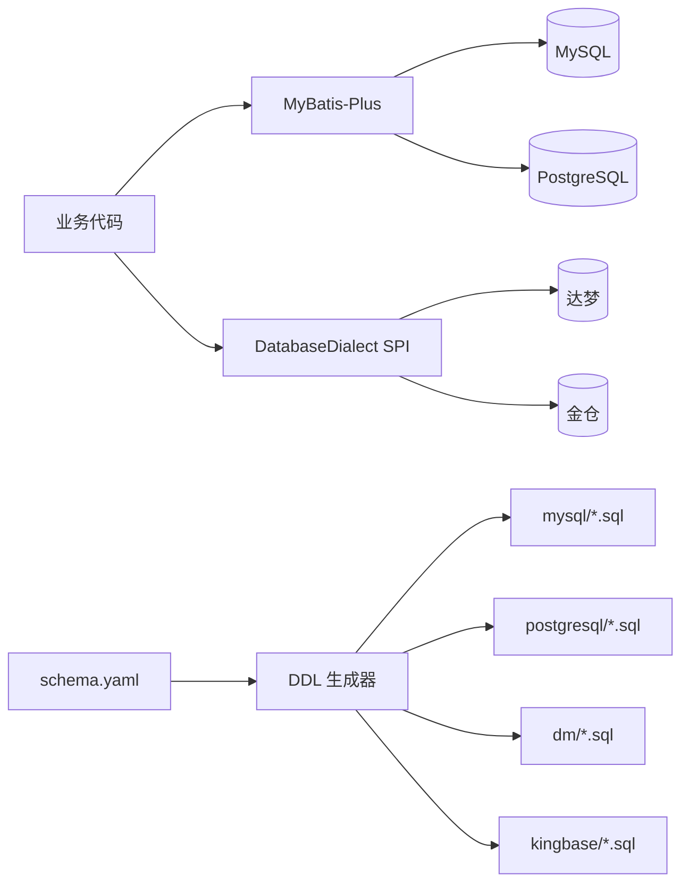
```mermaid
flowchart LR
  BIZ["业务代码"] --> MP["MyBatis-Plus"]
  BIZ --> SPI["DatabaseDialect SPI"]
  MP --> DB1[("MySQL")]
  MP --> DB2[("PostgreSQL")]
  SPI --> DB3[("达梦")]
  SPI --> DB4[("金仓")]
  SCHEMA["schema.yaml"] --> GEN["DDL 生成器"]
  GEN --> M1["mysql/*.sql"]
  GEN --> M2["postgresql/*.sql"]
  GEN --> M3["dm/*.sql"]
  GEN --> M4["kingbase/*.sql"]
```

---

## 19. 多语言体系

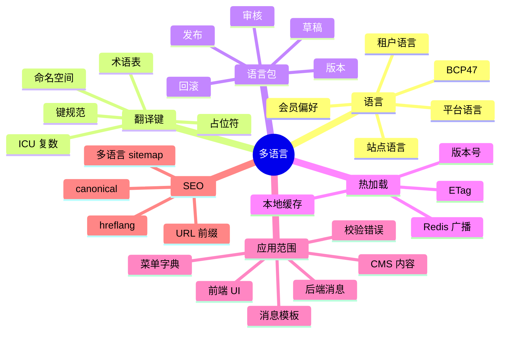
```mermaid
mindmap
  root((多语言))
    语言
      BCP47
      平台语言
      租户语言
      站点语言
      会员偏好
    翻译键
      命名空间
      键规范
      占位符
      ICU 复数
      术语表
    语言包
      草稿
      审核
      发布
      版本
      回滚
    热加载
      本地缓存
      Redis 广播
      ETag
      版本号
    应用范围
      后端消息
      校验错误
      菜单字典
      CMS 内容
      前端 UI
      消息模板
    SEO
      URL 前缀
      hreflang
      canonical
      多语言 sitemap
```

```mermaid
sequenceDiagram
  participant E as 编辑
  participant A as 翻译工作台
  participant DB as i18n 库
  participant R as Redis
  participant N as 应用节点
  participant F as 前端

  E->>A: 编辑译文
  A->>DB: 保存草稿
  E->>A: 发布
  A->>DB: 写入 i18n_pack 新版本
  A->>R: PUBLISH lx:i18n:reload
  R-->>N: 刷新本地缓存
  F->>N: GET /i18n/{lang}/{ns}?v=13
  N-->>F: 新语言包 + ETag
```

---

## 20. 多库与多语言在请求链路中的位置

```mermaid
flowchart TB
  REQ["请求"] --> TEN["租户解析<br/>TenantFilter"]
  TEN --> LANG["语言解析<br/>LocaleFilter"]
  LANG --> AUTH["认证 / 权限"]
  AUTH --> BIZ["业务 Service"]
  BIZ --> I18N["MessageSource<br/>错误 / 校验文案"]
  BIZ --> DIALECT["DatabaseDialect<br/>分页 / 函数 / JSON"]
  DIALECT --> DB[("MySQL / PG / DM / 金仓")]
  I18N --> CACHE["Caffeine + Redis"]
  BIZ --> CMS["CMS 内容翻译<br/>按 lang 查询 / 回退"]
```

